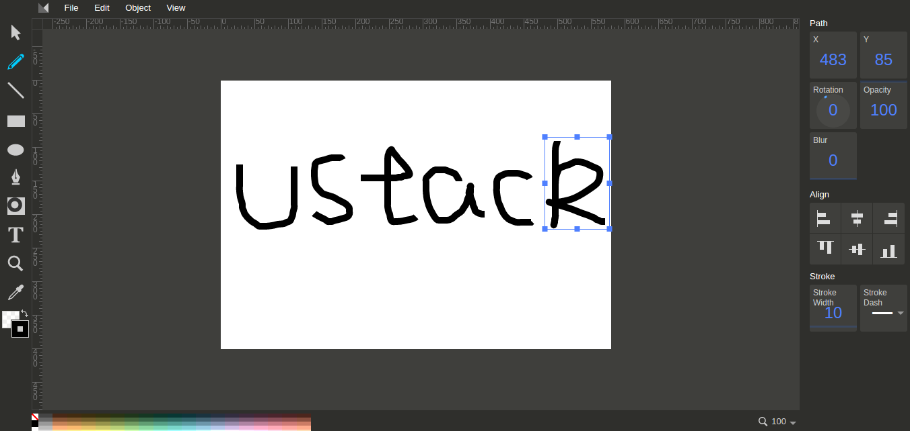

# 让svg写出你的名字

<!--sec data-title="难点在哪儿?" data-id="section1" data-show=true ces-->
1. svg路径像莫斯电码一般难以识别，如何写出自己的名字？
2. 就算名字画出来了如何能让他一笔一划的写出来？

#### 解决：
1. __svg路径像莫斯电码一般难以识别，如何写出自己的名字？__     

   __答：__ 对于简单的图形我们可以自己用代码画出来，对于比较复杂的图形我们可以用工具画出来！    
   网上svg绘图工具：http://editor.method.ac/    

   如下图所示：    
       

   __高大上！快准很！__    

   画完之后可以显示源码，将之复制即可使用！是不是很简单

2. __就算名字画出来了如何能让他一笔一划的写出来？__     

   __答：__ 要知道，path有两个属性：stroke-dasharray 和 stroke-dashoffset, 这两个属性完美解决问题！ 
<!--endsec-->  

## 那就来吧？

   __首先，大家要明白stroke-dasharray和stroke-dashoffset的含义～__    

   `stroke-dasharray`: 可控制用来描边的点划线的图案范式.    
   它是一个<length>和<percentage>数列，数与数之间用逗号或者空白隔开，指定短划线和缺口的长度。如果提供了奇数个值，则这个值的数列重复一次，从而变成偶数个值。因此，5,3,2等同于5,3,2,5,3,2。    

   `stroke-dashoffset`: 指定了dash模式到路径开始的距离.    


__所以当我们将stroke-dasharray设置为我们所画线段总长度的话，利用stroke-dashoffset就可以控制线段一点一点画出来了，bingo！__

代码如下：    

```javascript
//得到我们所化的线
var path = document.querySelector('#my path');
//获得线段的总长度
var length = path.getTotalLength();
//初始化动画
path.style.transition = path.style.WebkitTransition =
          'none';
//给动画设置初始值，也就是将stroke-dasharray置为线段总长，stroke-offset置为总长
path.style.strokeDasharray = length + ' ' + length;
path.style.strokeDashoffset = length;
// 获取一个区域，获取相关的样式，让浏览器寻找一个起始点。
path.getBoundingClientRect();
//动起来!
path.style.transition = path.style.WebkitTransition =
              'stroke-dashoffset 2s ease-in-out';
path.style.strokeDashoffset = '0';
```




__是不是很简单！__    

__那么问题来了，你家写字就一划啊！？__    

我的思路如下：    

1. 算出所有线段的总长度，然后计算每条线段占总长度的百分比。
2. forEach每个path数组，给动画加上setTimeout,间隔时间利用我们算出的百分比计算。    




### BINGO! 
